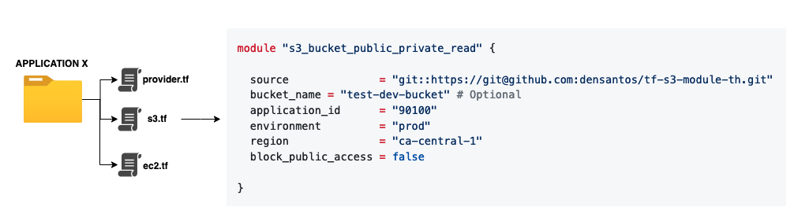

# tf-s3-module-th

This S3 bucket module is designed to deploy an S3 bucket with essential minimal features and configuration. 
It leverages S3 bucket policies to control access. 
This module supports three deployment types: public, private, and private with granular IAM access permissions. 
The following sections provide examples of each deployment scenario.

## Usage 

### Public/Private Bucket - Read-Only Access

```hcl
module "s3_bucket_public_private_read" {
  source              = "github.com/densantos/tf-s3-module-th"
  bucket_name = "app100-dev-bucket" # Optional
  application_id      = "90100"
  environment         = "prod"
  region              = "ca-central-1"
  block_public_access = false
}
```
### Private Bucket - Read-Only Access

```hcl
module "s3_bucket_private_read" {
  source              = "github.com/densantos/tf-s3-module-th"
  application_id      = "90100"
  environment         = "prod"
  region              = "ca-central-1"
  block_public_access = true
}
```
### Private Bucket - Read-Only Access with Granular Permission

```hcl
module "s3_bucket_granular_access" {
  source              = "github.com/densantos/tf-s3-module-th"
  application_id      = "90300"
  environment         = "uat"
  region              = "ca-central-1"
  block_public_access = true
  bucket_access_roles = [ "role_arn_1", "role_arn_2", "role_arn_3"  ]
}
```
## Deployment as part of an existing application Example


## Providers

| Name | Version |
|------|---------|
| <a name="provider_aws"></a> [aws](#provider\_aws) | n/a |

## Modules

No modules.

## Resources

| Name | Type |
|------|------|
| [aws_s3_bucket.bucket](https://registry.terraform.io/providers/hashicorp/aws/latest/docs/resources/s3_bucket) | resource |
| [aws_s3_bucket_policy.bucket_policy](https://registry.terraform.io/providers/hashicorp/aws/latest/docs/resources/s3_bucket_policy) | resource |
| [aws_s3_bucket_public_access_block.public_access](https://registry.terraform.io/providers/hashicorp/aws/latest/docs/resources/s3_bucket_public_access_block) | resource |
| [aws_caller_identity.current](https://registry.terraform.io/providers/hashicorp/aws/latest/docs/data-sources/caller_identity) | data source |
| [aws_iam_policy_document.policy](https://registry.terraform.io/providers/hashicorp/aws/latest/docs/data-sources/iam_policy_document) | data source |

## Inputs

| Name | Description | Type | Default | Required |
|------|-------------|------|---------|:--------:|
| <a name="input_application_id"></a> [application\_id](#input\_application\_id) | n/a | `string` | n/a | yes |
| <a name="input_block_public_access"></a> [block\_public\_access](#input\_block\_public\_access) | n/a | `bool` | `true` | no |
| <a name="input_bucket_access_roles"></a> [bucket\_access\_roles](#input\_bucket\_access\_roles) | List of arn roles that will be granted read access to the bucket | `list(string)` | `[]` | no |
| <a name="input_bucket_name"></a> [bucket\_name](#input\_bucket\_name) | n/a | `string` | `null` | no |
| <a name="input_environment"></a> [environment](#input\_environment) | n/a | `string` | n/a | yes |
| <a name="input_region"></a> [region](#input\_region) | AWS Region | `string` | n/a | yes |

## Outputs

| Name | Description |
|------|-------------|
| <a name="output_bucket_arn"></a> [bucket\_arn](#output\_bucket\_arn) | n/a |
